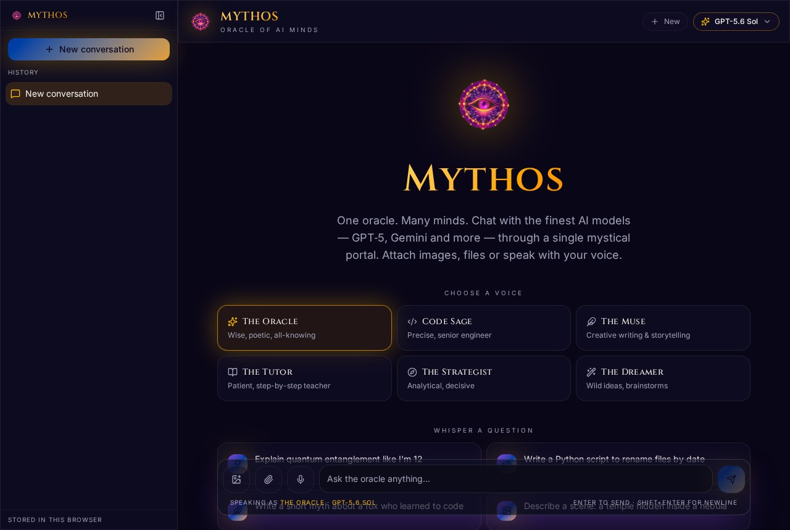
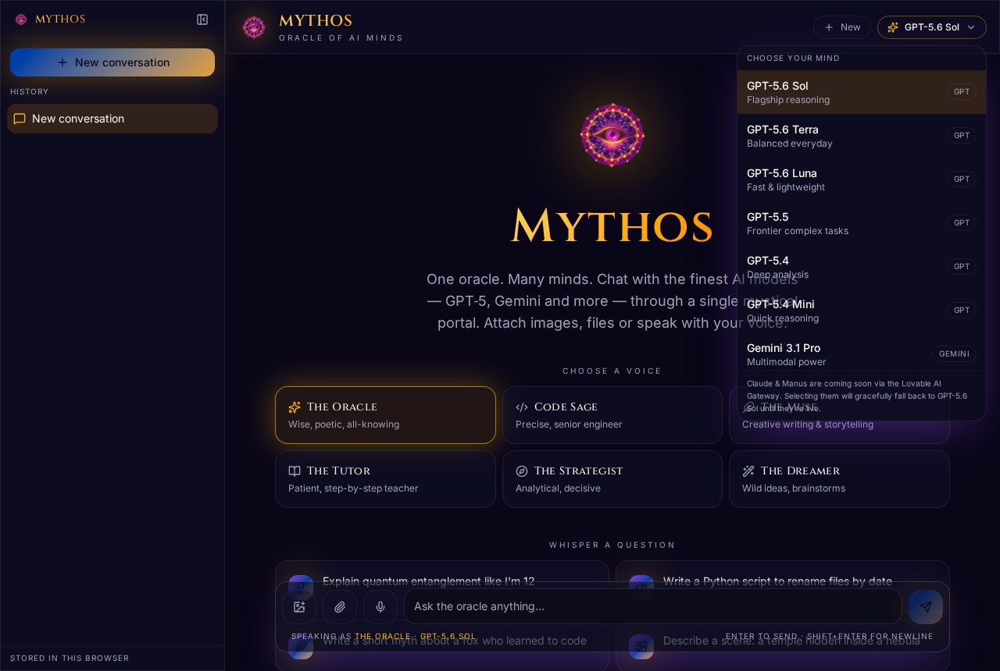
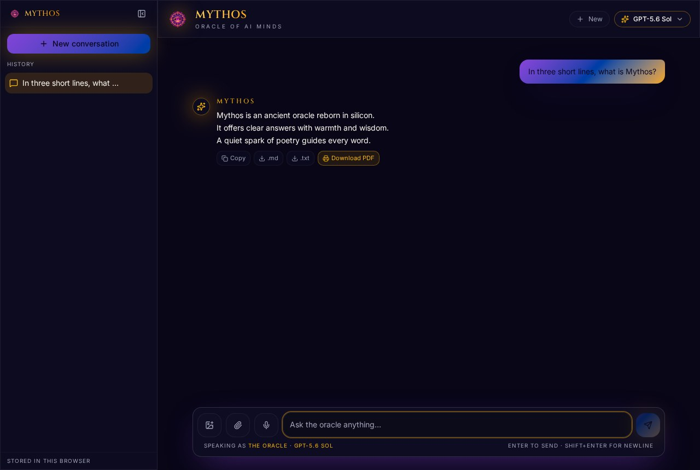
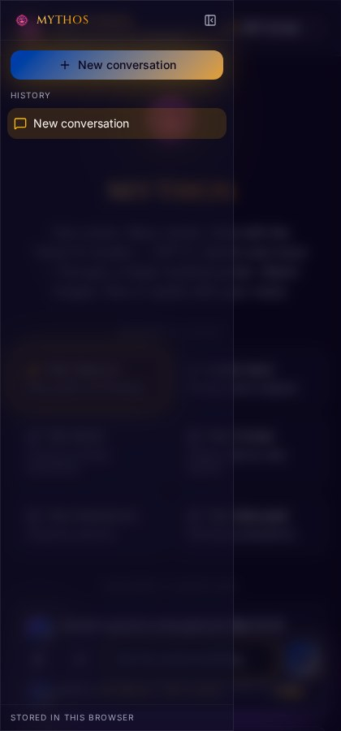

<div align="center">


# Mythos — Oracle of AI Minds

**One oracle. Many minds.** A single, beautifully crafted portal to the world's best AI models —
GPT-5.6, Gemini 3, Claude, Grok, Llama, DeepSeek, Mistral and an agentic Manus mode —
with attachments, voice input, image generation and true vector PDF export.

[](https://mythos-oracle-ai.lovable.app)


</div>

---

## Table of contents

- [What is Mythos](#what-is-mythos)
- [Screenshots](#screenshots)
- [Features](#features)
- [Supported models](#supported-models)
- [Personas](#personas)
- [Architecture](#architecture)
- [Project structure](#project-structure)
- [Getting started](#getting-started)
- [Environment variables](#environment-variables)
- [API reference](#api-reference)
- [PDF export engine](#pdf-export-engine)
- [Deployment](#deployment)
- [Roadmap](#roadmap)
- [License](#license)

---

## What is Mythos

Most AI apps lock you into one provider. Mythos is a **cosmic-themed universal AI console** that
puts every major frontier model behind one interface, one composer and one history sidebar.

Ask a question, pick the mind that should answer it, attach a photo or a PDF, dictate with your
voice, conjure an image, then export the whole answer as a typeset PDF. No provider switching, no
copy-paste between tabs.

Routing is **strict by design**: the model you select is the model that answers. If a model is
unavailable (for example Claude without an OpenRouter key), Mythos tells you clearly instead of
silently downgrading you to a cheaper model behind your back.

---

## Screenshots

### Landing — pick a voice, pick a mind
The aurora starfield, six personas, and prompt starters that get you moving in one click.



### Model selector — every frontier model in one menu
GPT-5.6 Sol / Terra / Luna, GPT-5.5, GPT-5.4, Gemini 3.1 Pro, Gemini Flash, Claude, Grok, Llama,
DeepSeek, Mistral and the Manus agent.



### Conversation — rich markdown, history sidebar, one-tap export
Streamed answers rendered with full markdown, plus Copy / .md / .txt / **Download PDF** on every
reply, and a persistent conversation list on the left.



### Mobile — the same oracle, thumb-sized
Fully responsive down to small phones, installable as a PWA from the browser menu.



---

## Features

| | Feature | Detail |
| --- | --- | --- |
| 🧠 | **Multi-model routing** | GPT + Gemini via the Lovable AI Gateway; Claude, Grok, Llama, DeepSeek, Mistral and Manus via OpenRouter. Chosen per message. |
| 🎭 | **Six personas** | Oracle, Code Sage, Muse, Tutor, Strategist, Dreamer — each swaps the system prompt. |
| ⚡ | **Streaming answers** | Token-by-token streaming through the Vercel AI SDK, so nothing feels like a dead spinner. |
| 📎 | **Attachments** | Images, PDFs and text files with preview chips before you send. |
| 🎙️ | **Voice input** | `MediaRecorder` capture transcribed server-side, dropped straight into the composer. |
| 🎨 | **Image generation** | Flip the composer into image mode and conjure artwork inline in the conversation. |
| 📄 | **Vector PDF export** | Real typeset PDFs with selectable text — headings, lists, quotes, code blocks, tables, images, page numbers. |
| 🗂️ | **Chat history** | Persistent sidebar: browse, rename and delete past conversations, stored in your browser. |
| 📱 | **Installable PWA** | Manifest, icons and theme colours — add to home screen on phone, tablet or desktop. |
| 🌌 | **Cosmic design system** | Deterministic starfield, gold/violet OKLCH palette, glassmorphic panels, Cinzel display type. |
| 🚦 | **Honest failures** | Unavailable model? You get a clear in-chat error, never a silent substitution. |

---

## Supported models

| Provider | Model identifier | Routed through | Status |
| --- | --- | --- | --- |
| OpenAI | `openai/gpt-5.6-sol` | Lovable AI Gateway | ✅ default |
| OpenAI | `openai/gpt-5.6-terra` | Lovable AI Gateway | ✅ |
| OpenAI | `openai/gpt-5.6-luna` | Lovable AI Gateway | ✅ |
| OpenAI | `openai/gpt-5.5` | Lovable AI Gateway | ✅ |
| OpenAI | `openai/gpt-5.4` | Lovable AI Gateway | ✅ |
| OpenAI | `openai/gpt-5.4-mini` | Lovable AI Gateway | ✅ |
| Google | `google/gemini-3.1-pro-preview` | Lovable AI Gateway | ✅ |
| Google | `google/gemini-3.6-flash` | Lovable AI Gateway | ✅ |
| Google | `google/gemini-3.1-flash-lite` | Lovable AI Gateway | ✅ |
| Anthropic | `anthropic/claude-opus-4.1` | OpenRouter | 🔑 needs key |
| Anthropic | `anthropic/claude-sonnet-4.5` | OpenRouter | 🔑 needs key |
| Anthropic | `anthropic/claude-3.7-sonnet` | OpenRouter | 🔑 needs key |
| xAI | `x-ai/grok-4` | OpenRouter | 🔑 needs key |
| Meta | `meta-llama/llama-3.3-70b-instruct` | OpenRouter | 🔑 needs key |
| DeepSeek | `deepseek/deepseek-r1` | OpenRouter | 🔑 needs key |
| Mistral | `mistralai/mistral-large` | OpenRouter | 🔑 needs key |
| Manus | `manus/manus-agent` | OpenRouter (Claude Sonnet 4.5 backend) | 🔑 needs key |

> **On Manus:** Manus does not publish a public inference API. Mythos exposes an agentic
> "Manus Agent" persona backed by Claude Sonnet 4.5 through OpenRouter, and says so up front —
> no pretending.

🔑 models come online the moment a valid `OPENROUTER_API_KEY` (starting with `sk-or-`) is present.

---

## Personas

| Persona | Character |
| --- | --- |
| **The Oracle** | Wise, poetic, all-knowing — the default voice |
| **Code Sage** | Precise senior engineer, code-first answers |
| **The Muse** | Creative writing and storytelling |
| **The Tutor** | Patient, step-by-step teaching |
| **The Strategist** | Analytical and decisive, business-minded |
| **The Dreamer** | Wild ideas and rapid brainstorming |

---

## Architecture

```text
                      ┌───────────────────────────────────────┐
   Browser            │  src/routes/index.tsx                 │
   (React 19)         │  composer · personas · model picker   │
                      │  history sidebar · markdown renderer  │
                      └──────────────┬────────────────────────┘
                                     │  fetch (streamed)
                      ┌──────────────▼────────────────────────┐
   TanStack Start     │  /api/chat  /api/generate-image        │
   server routes      │  /api/transcribe                       │
                      └───────┬───────────────────┬────────────┘
                              │                   │
              strict routing  │                   │
                  ┌───────────▼──────┐   ┌────────▼──────────┐
                  │ Lovable AI       │   │ OpenRouter        │
                  │ Gateway          │   │ Claude · Grok     │
                  │ GPT-5.x · Gemini │   │ Llama · DeepSeek  │
                  └──────────────────┘   │ Mistral · Manus   │
                                         └───────────────────┘

   Client-only:  src/lib/pdf-export.ts  →  jsPDF vector renderer
                 localStorage           →  conversation history
```

Key decisions:

- **Server-only keys.** `LOVABLE_API_KEY` and `OPENROUTER_API_KEY` are read inside route handlers
  and never reach the browser bundle.
- **No silent fallback.** `src/routes/api/chat.ts` validates the requested model against two
  explicit allowlists and returns `400` (unknown model) or `503` (key missing) rather than
  answering with a different model.
- **Deterministic starfield.** `CosmicBackground.tsx` uses a seeded PRNG instead of `Math.random()`
  so SSR and hydration agree.

---

## Project structure

```text
src/
├─ routes/
│  ├─ __root.tsx              app shell, fonts, PWA + SEO metadata
│  ├─ index.tsx               the entire Mythos console
│  └─ api/
│     ├─ chat.ts              strict multi-provider streaming chat
│     ├─ generate-image.ts    image generation endpoint
│     └─ transcribe.ts        voice → text endpoint
├─ lib/
│  ├─ ai-gateway.server.ts    Lovable AI Gateway provider
│  ├─ openrouter.server.ts    OpenRouter provider + model map
│  └─ pdf-export.ts           jsPDF vector PDF renderer
├─ components/
│  ├─ CosmicBackground.tsx    seeded animated starfield
│  └─ ui/                     shadcn/ui primitives
├─ assets/                    logo + nebula hero art
└─ styles.css                 OKLCH theme, glass utilities, prose styles

docs/screenshots/             README imagery
public/manifest.webmanifest   PWA manifest
```

---

## Getting started

Requires **Node.js 20+** (or Bun) and npm.

```sh
git clone <this-repository-url>
cd <repository-name>
npm install
npm run dev
```

The app runs at **http://localhost:8080**.

| Script | Purpose |
| --- | --- |
| `npm run dev` | Start the dev server with HMR |
| `npm run build` | Production build |
| `npm run preview` | Preview the production build locally |
| `npm run lint` | ESLint |
| `npm run format` | Prettier |

---

## Environment variables

Create a `.env` in the project root:

```sh
# Required — powers GPT-5.x and Gemini via the Lovable AI Gateway
LOVABLE_API_KEY=your_lovable_api_key

# Optional — unlocks Claude, Grok, Llama, DeepSeek, Mistral and Manus
OPENROUTER_API_KEY=sk-or-v1-your_openrouter_key
```

Get an OpenRouter key at [openrouter.ai/keys](https://openrouter.ai/keys). Keys that do not start
with `sk-or-` are rejected before any request is made, and the UI explains why.

Both variables are **server-side only**. Never expose them with a `VITE_` prefix.

---

## API reference

### `POST /api/chat`

Streams a UI message stream (Vercel AI SDK format).

```jsonc
{
  "messages": [{ "role": "user", "parts": [{ "type": "text", "text": "Hello" }] }],
  "model": "openai/gpt-5.6-sol",
  "system": "You are Mythos — a wise, imaginative AI oracle."
}
```

| Status | Meaning |
| --- | --- |
| `200` | Streaming response |
| `400` | `messages` missing, or unknown model id |
| `500` | `LOVABLE_API_KEY` not configured |
| `503` | Model requires OpenRouter and no valid key is present |
| `502` | Upstream provider failed |

### `POST /api/generate-image`

Generates artwork from a prompt and returns it for inline rendering in the conversation.

### `POST /api/transcribe`

Accepts recorded audio and returns the transcript that fills the composer.

---

## PDF export engine

`src/lib/pdf-export.ts` is a hand-written **vector** renderer on top of jsPDF and the `marked`
lexer — not a screenshot of the page.

- Selectable, searchable text (no rasterised canvas)
- Georgia/Times serif body, Helvetica metadata, Courier code
- Mythos gold + violet header with model and persona attribution
- Styled headings, ordered/bulleted nested lists, gold-bar blockquotes
- Rounded dark code blocks and full multi-column tables with wrapping
- Embedded generated images with aspect ratio preserved
- Automatic pagination with widow/orphan avoidance, footers and page numbers

`html2canvas` was deliberately removed: it crashes on Tailwind v4 `oklch()` colours and produced
blurry, unsearchable output.

---

## Deployment

Mythos is built and hosted on [Lovable](https://lovable.dev) and deployed at
**https://mythos-oracle-ai.lovable.app**.

To deploy elsewhere, build with `npm run build` and host the TanStack Start output on any platform
that runs an edge/serverless JavaScript runtime (Cloudflare Workers, Vercel, Netlify), setting the
environment variables above in that platform's dashboard.

---

## Roadmap

- [ ] Server-side conversation sync across devices
- [ ] Streamed reasoning traces for reasoning-capable models
- [ ] Video generation mode
- [ ] Shareable public conversation links
- [ ] True offline mode with a cached model-free assistant shell
- [ ] Native Manus API once it ships publicly

---

## License

MIT — use it, fork it, remix it.

<div align="center">

**Built by Akshat Thakur** · Crafted with [Lovable](https://lovable.dev)

</div>
